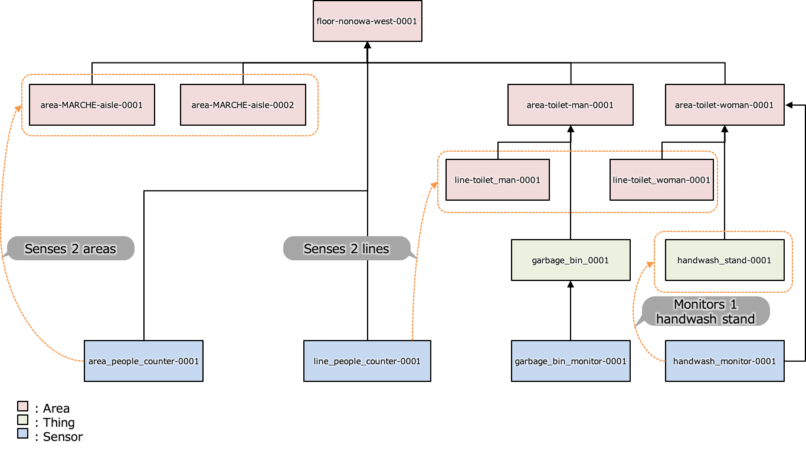

# Tenant Data Model and Configurations

This is the README to show how to create and configure the tenant data.

## File structure

This folder `data` contains configuration files and model data for each teant. Each tenant data is deployed into the tenant environment. That's why basically the file structure should follow below.

- data
  - tenants
    - TENANT_NAME
      - cloudant: directory where documents are
        - assets.json: JSON file that contains assets of location and physical things
        - assets_staff.json: JSON file that has staff
        - shops.json: JSON file that is shop list for signage
      - cos: directory where static files are
        - files you need
  - common
    - cloudant
      - notification-template.json: JSON file having template for notification
      - view-config.json: JSON file to set variables for UI

## Assets

### Asset structure

We manage all devices (sensors), logical locations and so on as "assets." They are stored in database and used by the risk calculator and the covsafe-view UI. In our scinarios, assets are managed hierarchically as follows. Each asset has "belongs" and "belongings" key to express parent/child relationships.

- Buildings
- Floors
- Areas
  - Aisle
  - Toilet
- Sensor devices
- Things
  - Handwash stands
  - Garbage bins

### Asset model

- id: Unique sensor id. You can include “a-z, A-Z, 0-9, _, ., -”, up to 36 chars. This is based on device ID formant. Naming rules are;
  - separate words by `_`.
  - separate sentences (one meaning words) by `-`.
  - Example: area_things_aisle-0001, area_people_counter-0001
- name: device/area/thing name
- description: explanation of this thing
- type: Type specification for assets. The followings are allowed.
  - building:
  - floor:
  - area: Indicates the asset is about area information.
  - sensor: Indicates the asset is sensor device or edge information.
  - thing: Staffs in a specific area. For example handwash stands or garbage bin in a area.
- subType: More detail type of the asset. The candidates are as follows.
  - For area asset
    - aisle
    - toilet
    - line (for line based people counters)
  - For sensor asset
    - area_people_counter: A sensor which counts the number of people in specific area at certain time.
    - line_people_counter:  A sensor which counts the number of people passed on a specific line in a certain period time.
    - handwash_monitor:  A sensor which counts the number of people who washed their hands in a certain period time.
    - garbage_bin_monitor: A sensor which monitors the distance from the roof of a garbage bin to the top of garbage inside.
  - For thing assets
    - handwash_stand
    - garbage_bin
- belongs: Identifications of the parent asset.
- belongings: Identifications of child assets.
- mapCoordinate: Coordinate information for floor map. (NOTE: In MVP we can specify only square boxes. But this should be more flexible to express not only boxes but also circles, trapezoids, lines and points in the future)
  - lat: virtual latitude for coordinate
  - lng: virtual longitude for coordinate
  - height: height of a cell
  - width: width of a cell
- realCoordinate: N/A
- settings: Some setting data for each sensor/edge. Element is depends on its devise type.
- isLogical: boolean value showing whether or not this thing is logical

### Asset logical coordinate system

We adopt virtual coordinate system for the indoor map. Why? The UI shows the indoor map within different map size, even it's getting changed when user changes the display size (responsible). The UI also shows the map in several pages, each of which has different window size. Each tenant must uses different image size for the indoor map. Every indoor map doesn't require real coordinates because it's a bit bothersome to fit the image into the real coordinate system (which is north? like that). We can say many reasons not to want to use and fit the real coordinate system for the indoor map.

Our way is easy: paste your map into sort of draw app and divide it by cell whichever size you want. Its coordinates start left-bottom, which means the left-bottom is [0, 0], and the right-top is [HEIGHT_OF_IMAGE, WIDTH_OF_IMAGE]. If you use 640x480 image for the indoor map, HEIGHT_OF_IMAGE is 480, so is WIDTH_OF_IMAGE 640. It causes the height of cell to HEIGHT_OF_IMAGE/NUMBER_OF_PORTRAIT_CELL and the width of cell to WIDTH_OF_IMAGE/NUMBER_OF_LANDSCAPE_CELL. That's it. On this coordinate system, you can put sensors whichever cell you want, and put the coordinate into its asset.mapCoordinate.[lat/lng]. Our UI understand this coordinate system and translate it to each map view.

The powerpoint file in `/path/to/delivery/data/tenants/c4c/tools/coordinate.pptx` is a good example and a teacher for you to get known this coordinate system.

## Asset model example

Here is the asset structure for an example.


```json
[
  {
    "id": "floor-nonowa_west-0001",
    "name": "Nonowa WEST",
    "description": "",
    "type": "area",
    "subType": "aisle",
    "belongs": "building-0001",
    "belongings": [
      "area-MARCHE_aisle-0001",
      "area-MARCHE_aisle-0002",
      "area-toilet_man-0001",
      "area-toilet_woman-0001",
      "area-people_counter-0001",
      "line-people_counter-0001"
    ],
    "mapCoordinate": {
        "x": 100,
        "y": 100,
        "height": 20,
        "width": 300
    },
    "realCoordinate": {},
    "settings": {}
  },
  {
    "id": "area-MARCHE_aisle-0001",
    "name": "MARCHE aisle 1",
    "description": "",
    "type": "area",
    "subType": "aisle",
    "belongs": "floor-nonowa_west-0001",
    "belongings": [],
    "mapCoordinate": {
        "x": 100,
        "y": 100,
        "height": 20,
        "width": 300
    },
    "realCoordinate": {},
    "settings": {}
  },
  {
    "id": "area-MARCHE_aisle-0002",
    "name": "MARCHE aisle 2",
    "description": "",
    "type": "area",
    "subType": "aisle",
    "belongs": "floor-nonowa_west-0001",
    "belongings": [],
    "mapCoordinate": {
        "x": 100,
        "y": 200,
        "height": 20,
        "width": 300
    },
    "realCoordinate": {},
    "settings": {}
  },
  {
    "id": "area-toilet_man-0001",
    "name": "Toilet (Man)",
    "description": "",
    "type": "area",
    "subType": "toilet",
    "belongs": "floor-nonowa_west-0001",
    "belongings": [
      "handwash_stand-0001",
      "garbage_bin-0001"
    ],
    "mapCoordinate": {
        "x": 100,
        "y": 400,
        "height": 50,
        "width": 50
    },
    "realCoordinate": {},
    "settings": {}
  },
  {
    "id": "area-toilet_woman-0001",
    "name": "Toilet (Woman)",
    "description": "",
    "type": "area",
    "subType": "toilet",
    "belongs": "floor-nonowa_west-0001",
    "belongings": [],
    "mapCoordinate": {
        "x": 200,
        "y": 400,
        "height": 50,
        "width": 50
    },
    "realCoordinate": {},
    "settings": {}
  },
  {
    "id": "line-toilet_man-0001",
    "name": "Line for people counter in front of the man toilet",
    "description": "",
    "type": "area",
    "subType": "line",
    "belongs": "area-toilet_man-0001",
    "belongings": [],
    "mapCoordinate": {
        "x": 100,
        "y": 400,
        "height": 50,
        "width": 50
    },
    "realCoordinate": {},
    "settings": {}
  },
  {
    "id": "line-toilet_woman-0001",
    "name": "Line for people counter in front of the woman toilet",
    "description": "",
    "type": "area",
    "subType": "line",
    "belongs": "area-toilet_woman-0001",
    "belongings": [],
    "mapCoordinate": {
        "x": 200,
        "y": 400,
        "height": 50,
        "width": 50
    },
    "realCoordinate": {},
    "settings": {}
  },
  {
    "id": "handwash_stand-0001",
    "name": "Handwash stand in man toilet",
    "description": "",
    "type": "thing",
    "subType": "handwash_stand",
    "belongs": "area-toilet_man-0001",
    "belongings": [
      "handwash_monitor-0001"
    ],
    "mapCoordinate": {
        "x": 130,
        "y": 400,
        "height": 10,
        "width": 10
    },
    "realCoordinate": {},
    "settings": {}
  },
  {
    "id": "garbage_bin-0001",
    "name": "Garbage bin in man toilet",
    "description": "",
    "type": "thing",
    "subType": "garbage_bin",
    "belongs": "area-toilet_man-0001",
    "belongings": [
      "garbage_bin_monitor-0001"
    ],
    "mapCoordinate": {
        "x": 140,
        "y": 400,
        "height": 50,
        "width": 50
    },
    "realCoordinate": {},
    "settings": {}
  },
  {
    "id": "area_people_counter-0001",
    "name": "People counter for floor areas",
    "description": "",
    "type": "sensor",
    "subType": "area_people_counter",
    "belongs": "floor-nonowa_west-0001",
    "belongings": [],
    "mapCoordinate": {
        "x": 110,
        "y": 110,
        "height": 0,
        "width": 0
    },
    "realCoordinate": {},
    "settings": {}
  },
  {
    "id": "line_people_counter-0001",
    "name": "People counter for the toilets",
    "description": "",
    "type": "sensor",
    "subType": "line_people_counter",
    "belongs": "floor-nonowa_west-0001",
    "belongings": [],
    "mapCoordinate": {
        "x": 51,
        "y": 51,
        "height": 0,
        "width": 0
    },
    "realCoordinate": {},
    "settings": {
      "base_distance": 200
    }
  },
  {
    "id": "handwash_monitor-0001",
    "name": "Handwash monitor for the man toilet",
    "description": "",
    "type": "sensor",
    "subType": "handwash_monitor",
    "belongs": "handwash_stand-0001",
    "belongings": [],
    "mapCoordinate": {
        "x": 51,
        "y": 51,
        "height": 0,
        "width": 0
    },
    "realCoordinate": {},
    "settings": {
      "handwash_activity_time_threshold": 10
    }
  },
  {
    "id": "garbage_bin_monitor-0001",
    "name": "Garbage bin monitor in the man toilet",
    "description": "",
    "type": "sensor",
    "subType": "garbage_bin_monitor",
    "belongs": "garbage_bin-0001",
    "belongings": [],
    "realCoordinate": {},
    "settings": {
      "garbage_bin_depth": 100,
      "alert_threshold": 80
    }
  }
]
```
